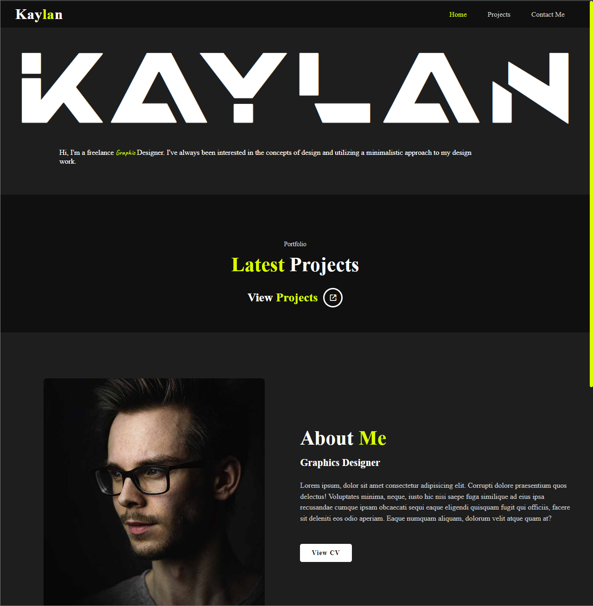
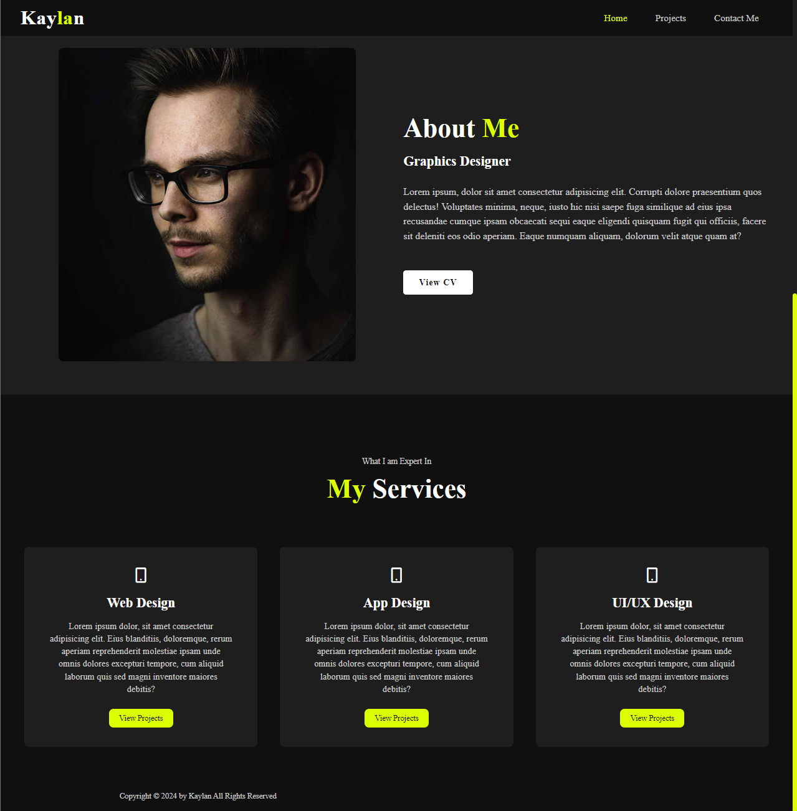
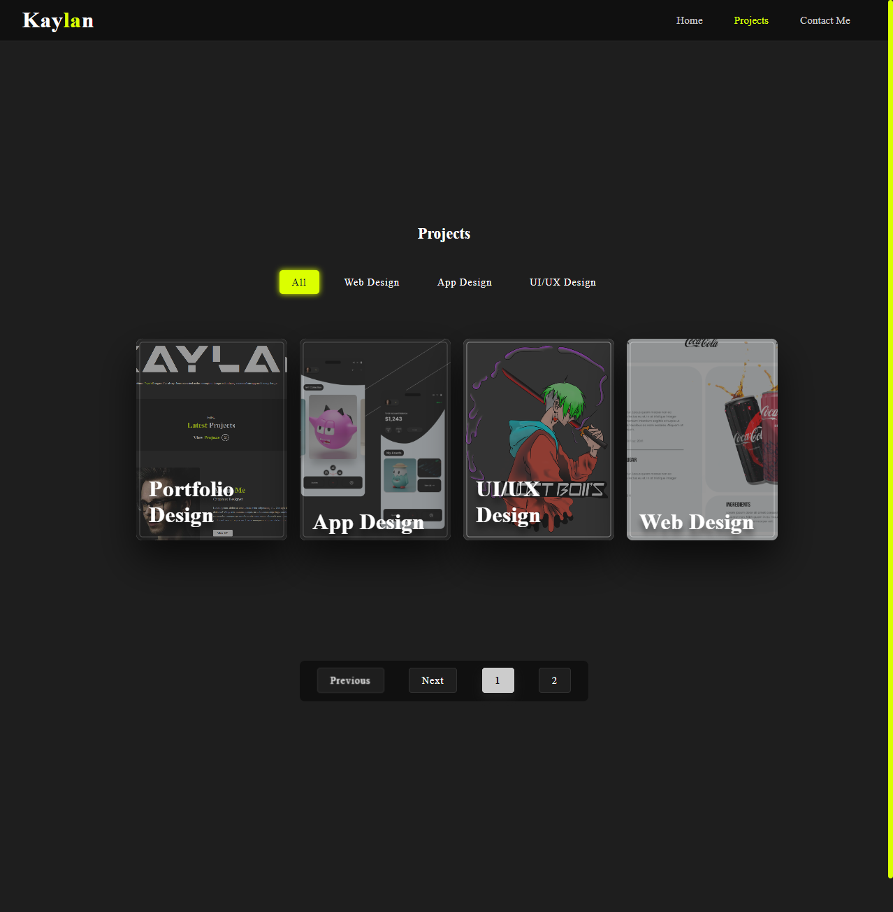
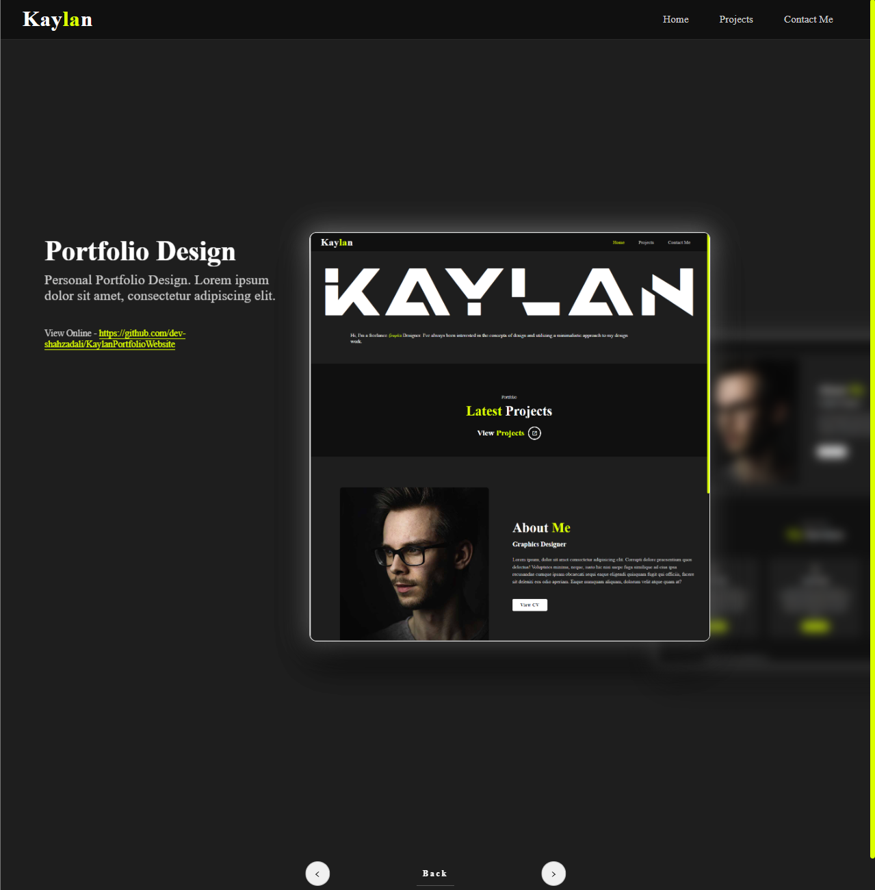
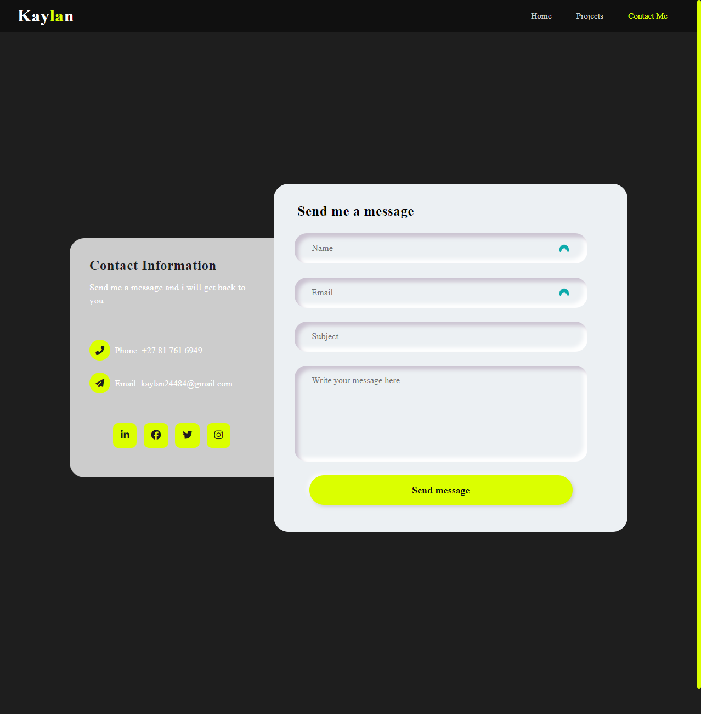

# Django Dynamic Portolio Website

This is a dynamic website built using Python and the Django framework. The website features a homepage, a project page, and a contact page. It is designed to be easily managed through the Django admin interface.

## Language and Framework

- **Language:** Python
- **Framework:** Django

## Pages

- **Homepage:** The main landing page of the website.
- **Project Page:** Displays a list of projects that can be added and managed through the admin interface.
- **Contact Page:** Allows users to send an email to the website owner.

## Functionalities

- **Admin Management:** All user information and projects can be added and managed through the Django admin interface.
- **Project Display:** Projects added through the admin interface are dynamically displayed on the project page.
- **Contact Form:** The contact page includes a form that users can fill out to send an email to the website owner.

## Features

- **Dynamic Content:** The website is connected to a database, allowing for dynamic content updates while the website is running.
- **Admin Interface:** Easy management of user information and projects through Django's powerful admin interface.
- **Email Functionality:** Users can contact the website owner via the contact page.

## Installation

To get a local copy up and running follow these simple steps:

### Prerequisites

List any prerequisites that need to be installed for your project. For example:

- Python 3.x
- pip
- virtualenv (optional but recommended)

### Installation Steps

1. **Clone the repository:**

    ```sh
    git clone https://github.com/yourusername/your-repo.git
    ```

2. **Navigate to the project directory:**

    ```sh
    cd your-repo
    ```

3. **Create and activate a virtual environment (optional but recommended):**

    ```sh
    python -m venv env
    source env/bin/activate  # On Windows use `env\Scripts\activate`
    ```

4. **Install the required packages:**

    ```sh
    pip install -r requirements.txt
    ```

5. **Set up environment variables:**

    Describe any environment variables that need to be set up. You can create a `.env` file in the root directory and add the environment variables there.

    ```sh
    SECRET_KEY='your_secret_key'
    DEBUG=True
    ```
    To use the contact page email functionality you will need to add gmail account and also get app password from your gmail account and add to .env file. Also change          email address in KAYLAN/kaylan/views.py under contact view function. The email in .env file is used to send the email from and the email in views.py will receive the 
    email from the website.
    ```
    EMAIL_HOST_USER='gmail'
    EMAIL_HOST_PASSWORD='gmail_app_password'
    ```

6. **Apply the database migrations:**

    ```sh
    python manage.py migrate
    ```

7. **Create a superuser:**

    ```sh
    python manage.py createsuperuser
    ```

8. **Run the development server:**

    ```sh
    python manage.py runserver
    ```


## Screenshots

### Home Page



### Project Page


### Project Details Page


### Contact Page


